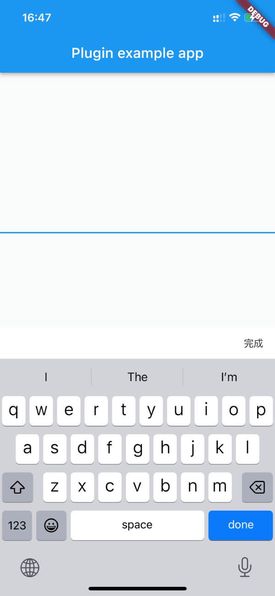

# flutter_keyboard_done

A new Flutter Plugin for IOS where show a done button when you inputing somethings.



## Getting Started

#### Import
```dart
import 'package:flutter_keyboard_done/flutter_keyboard_done.dart';
```
#### Usage

```dart

class _MyAppState extends State<MyApp> {

  @override
  Widget build(BuildContext context) {
    return MaterialApp(
      home: FlutterKeyboardDoneWidget(
        child: Scaffold(
          body: const Center(
            child: TextField(),
          ),
          appBar: AppBar(
            title: Text('Plugin example app'),
          ),
        ),
      ),
    );
  }
}

```

